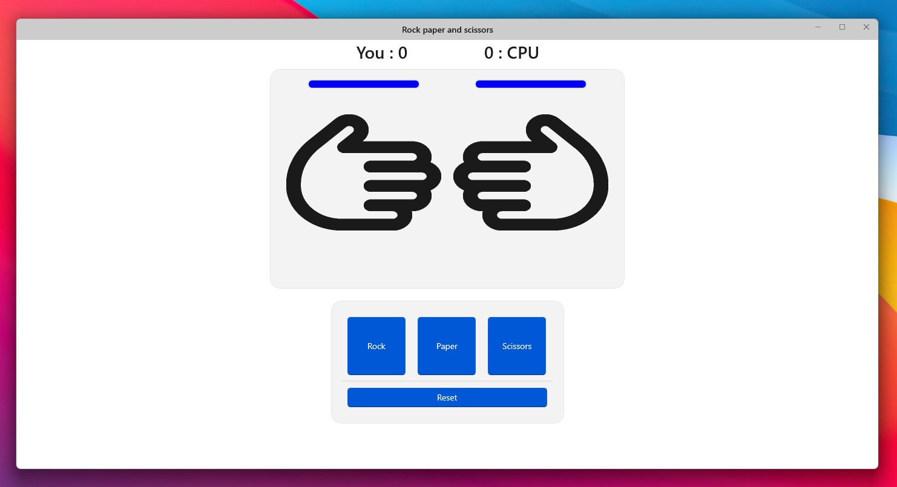

# Rock-paper-and-scissors-WinUI3

# Description
The Rock, Paper, Scissors game is a classic two-player game where players choose one of three symbols: rock, paper or scissors to find out who is the winner of the round. The game was written in C# using the WinUI3 framework which provides a Windows user interface.

# Author
**Name:** Mateusz Szelec

**Class:** 2AP

**Nick:** ITAM

**E-Mail:** szelec.mateusz@zs4.tychy.edu.pl
