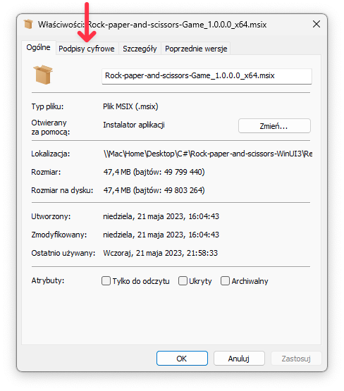

# How to install .MSIX (or .APPX) package with Certificate

## 1. Select "Properties" from the right-click menu of the MSIX package.

## 2. Go to the "Digital Signature" tab.

## 3. From the "Signature List" choose the certificate.

## 4. Click on "Details".

## 5. Click on "View Certificate".

## 6. Click "Install Certificate".

## 7. Choose "Local Machine" from "Store Location".

## 8. Allow the app to install certificates.

## 9. Choose "Place all certificates in the following store".

## 10. Click "Browse" and select "Trusted People".

## 11. Click "OK" and Click "Next" then Click "Finish"

## 12. Then you should see a popup window with the message “Import was successful”

## 13. Now you can install the .MSIX package on your computer

# Video on Youtube
**Link:** https://youtu.be/QKhr7a783wA
